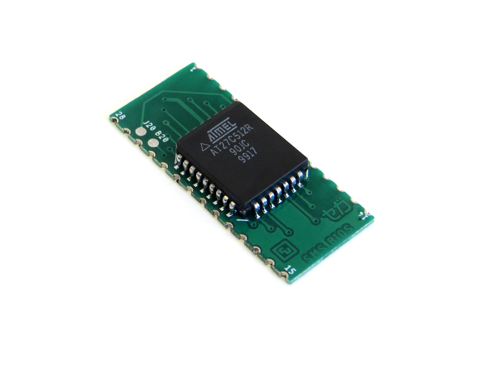

Working on designs to release for free can be both time consuming and expensive. If you like what I do, a small donation will go a long way in helping me continue to serve the modding community as best as I can, with many more free and original guides, designs, and ideas to come.

# Sega Master System Quick Solder BIOS

The SEGA Master System Quick Solder BIOS is an additional BIOS that can solder beneath the original BIOS to enable multiBIOS operation. It is designed to compliment the switchless region & BIOS support mod kits which can enable the BIOS when set for the extended region modes. Combined with the switchless region & BIOS support mod kit, the BIOS is operated switchlessly. It can also be installed conventionally with a switch, but that would be silly.

## Requirements

1 - A SEGA Master System with a 28-Pin BIOS.

AND

2 - A switchless region & BIOS support mod kit installed (for switchless operation).

OR

2 - A SPDT (On-On) switch and 2 x 1-kilohm Resistors (for switch operation)

## Compatibility

Currently it only supports piggybacking on a 28-Pin BIOS. 32-Pin BIOS support will be added, if possible.

It should work with any Master System with a 28-Pin BIOS.

## Manufacturing

- 1mm or 0.8mm PCB thickness are both fine.

- Castellated vias is recommended. Thin PCBs with non-castellated half cut vias don't generally result in torn up copper plating but cleaning the vias can be a time consuming chore.

## Future Work

32-Pin BIOS support

## Version History

- Quick Solder BIOS v1.0 - 19/11/2022
- Quick solder BIOS v1.1 - 06/05/2023

## License

If you use this in any way, shape or form, you must include a link back to this repository and mention me by name on any sales pages and social media posts. Not only will this help me to keep designing mod kits and offering them to the community, but it is basic common courtesy as well. Don't be a douchebag. :)

Also this 'GNU GENERAL PUBLIC LICENSE Version 2, June 1991'.

## Donate

Working on designs to release for free can be both time consuming and expensive. If you like what I do, a small donation will go a long way in helping me continue to serve the modding community as best as I can, with many more free and original guides, designs, and ideas to come.

